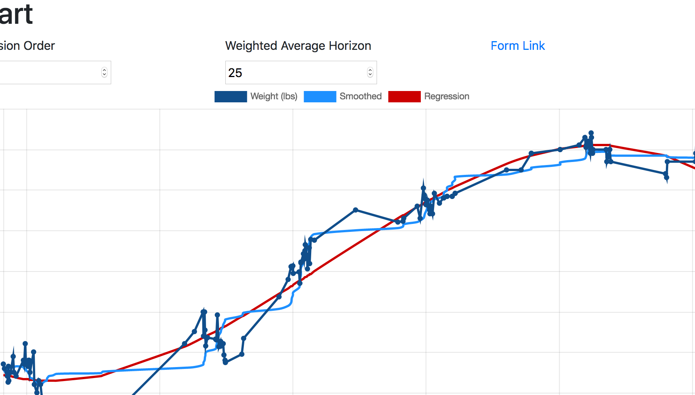

# Weight Tracker Form

A dead simple way to track body weight or any other metric using Google Forms, Google Sheets, and Google App Scripts. Completely hosted for free on Google's infrastructure, this was made with the following resources:

* Ben Collin's [Creating a d3 chart with data from Google Sheets](https://www.benlcollins.com/spreadsheets/d3-google-sheets/)
* [ChartJS](www.chartjs.org)
* [Bootstrap](getbootstrap.org)

More details and instructions can be found here: [Dynamic weight tracking form and dashboard](http://sean.lane.sh/blog/2018/Weight-tracker-form)